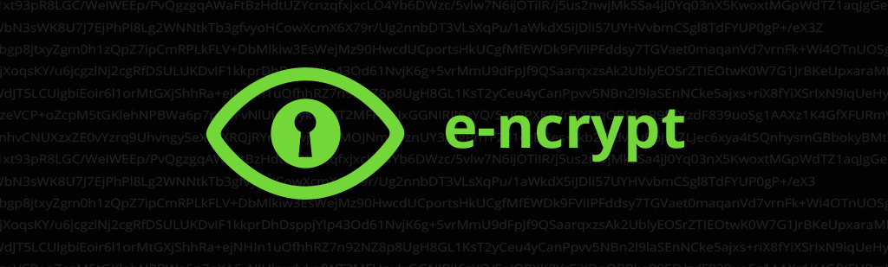

# E-ncrypt

Client-side encryption and hashing in your browser — no data ever leaves your device.

**Live site:** [https://e-ncrypt.com](https://e-ncrypt.com)



## Features

- **Encrypt & decrypt** text locally with a password
- **Hash** content with configurable algorithms and rounds
- **Settings** for algorithm choice, iteration rounds, and dark mode
- **Privacy-first** — all cryptography runs in the browser via [CryptoJS](https://cryptojs.gitbook.io/docs/); no external APIs are called

## Supported algorithms

| Encryption | Hashing |
|------------|---------|
| AES | MD5 (unsafe) |
| TripleDES | SHA-1 |
| Rabbit | SHA-256 |
| | SHA-512 |
| | SHA-3 |
| | RIPEMD-160 |

## Tech stack

- [Angular](https://angular.dev/) 22 with static prerender (SSG)
- [Tailwind CSS](https://tailwindcss.com/) v4
- [Angular Aria](https://angular.dev/guide/aria/overview)
- [CryptoJS](https://github.com/brix/crypto-js)
- [Vitest](https://vitest.dev/) for unit tests

## Getting started

Requires Node.js 24+ (see [`.nvmrc`](.nvmrc)).

```bash
npm install
npm start
```

Open [http://localhost:4200](http://localhost:4200)

## Scripts

| Command | Description |
|---------|-------------|
| `npm start` | Dev server |
| `npm run build` | Production SSG build → `dist/e-ncrypt/browser/` |
| `npm test` | Run unit tests |
| `npm run watch` | Development build with watch mode |

## Production build (SSG)

The app is prerendered at build time for static hosting on nginx:

```bash
npm run build
```

Output: `dist/e-ncrypt/browser/`

## Deployment

1. Copy [`nginx.conf`](nginx.conf) to your server and set `root` to the deployed browser folder.
2. Deploy the build output:

```bash
rsync -avz --delete dist/e-ncrypt/browser/ user@host:/var/www/e-ncrypt/browser/
```

3. Reload nginx.

GitHub Actions deploys automatically on push to `main`/`master` when `SERVER_HOST`, `SERVER_USERNAME`, and `SERVER_PASSWORD` secrets are configured (see [`.github/workflows/deploy.yml`](.github/workflows/deploy.yml)).

## Legacy reference

The [`migrate/`](migrate/) folder contains the original Ionic/Angular 11 source for reference only.

## License

[MIT](LICENSE) © [Emiel Kwakkel](https://github.com/emielkwakkel)

## Links

- [GitHub repository](https://github.com/emielkwakkel/e-ncrypt)
- [CryptoJS documentation](https://cryptojs.gitbook.io/docs/)
